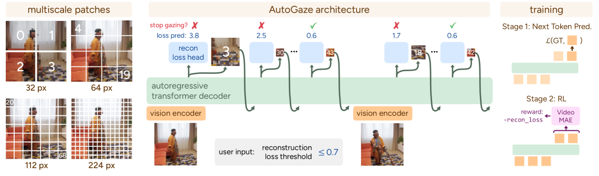
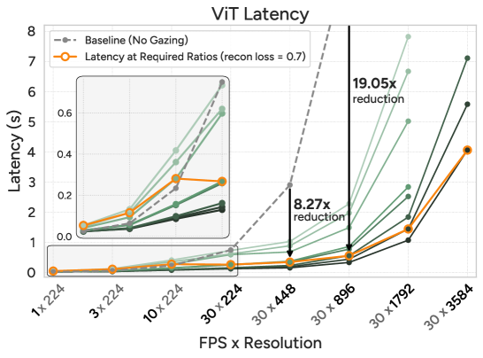

# 论文解读：Attend Before Attention: Efficient and Scalable Video Understanding via Autoregressive Gazing

**作者**：Baifeng Shi, Stephanie Fu, Long Lian, Hanrong Ye, David Eigen, Aaron Reite, Boyi Li, Jan Kautz, Song Han, David M. Chan, Pavlo Molchanov, Trevor Darrell, Hongxu Yin
**机构**：UC Berkeley, MIT, Clarifai, NVIDIA
**arXiv**：2603.12254 | **日期**：2026年3月12日

---

## TLDR

提出AutoGaze，一个仅3M参数的轻量级模块，在ViT处理之前自回归地选择多尺度patch以去除视频冗余。视觉token减少4×-100×，ViT加速最高19×，MLLM加速最高10×，实现1K帧4K分辨率视频理解，VideoMME达67.0%。同时提出首个高分辨率长视频QA基准HLVid（5分钟4K视频），AutoGaze比基线提升10.1%，比之前最佳MLLM高4.5%。

---

## 动机与发现

### 问题：如何高效处理长视频和高分辨率视频

现有MLLM对视频每一帧的每个像素都同等处理，但视频存在大量时空冗余（静态背景、重复区域）。现有token压缩方法通常只在LLM层面裁剪token，ViT仍需处理全部像素，形成效率瓶颈。

### 关键发现

1. **运动是主要信息源**：AutoGaze优先选择光流大的运动区域patch
2. **尺度与细节匹配**：细节丰富区域使用更细粒度尺度，平坦区域用粗粒度尺度
3. **OOD泛化能力强**：在未见过的视频风格和语义上仍能正确追踪变化区域
4. **高FPS/高分辨率更高效**：30FPS 4K视频仅需约1%的patch即可达到0.7重建损失

---

## 方法

*图2: AutoGaze架构与训练流程。左中：自回归地解码多尺度patch索引；右：两阶段训练：NTP预训练 + RL后训练*

**核心思想**

AutoGaze是一个3M参数的轻量模型，包含卷积编码器和自回归transformer解码器。它逐帧处理视频，自回归地选择最小的多尺度patch集合，使重建损失低于用户指定阈值。

### 自回归注视机制

AutoGaze交替进行帧编码和patch选择。对第一帧编码后解码patch索引，第二帧基于两帧特征和第一帧的注视历史来解码patch索引，从而避免选择冗余patch。解码过程类似LLM，但词汇表是patch索引{1,...,V}而非词语。

### 自动决定注视长度

解码器增加一个预测头，在每步解码时预测当前已选patch的重建损失。一旦预测损失低于阈值，自动停止对该帧的注视。

### 多尺度注视

词汇表包含多尺度patch（如1×1、2×2、4×4、8×8），解码器可根据区域细节程度选择不同尺度。平坦区域用粗粒度patch覆盖大面积，细节区域用细粒度patch捕获精细信息。

**关键创新点：**
- 在ViT之前去除冗余patch（而非ViT之后），从源头减少计算
- 多尺度patch选择，适配不同细节程度区域
- 多token预测，一次输出多个patch索引，加速解码

### 两阶段训练

**NTP预训练**：在800K视频中用贪心搜索收集250K视频的准最优注视序列，用next-token prediction损失训练模型学习子最优注视策略。

**RL后训练**：用简化GRPO算法，以重建损失为奖励，发现更优的注视序列。奖励为未来帧负重建损失的折扣累积。

### 下游应用

尽管训练在16帧224×224视频上，AutoGaze可处理任意分辨率和时长视频。将视频分割为16×224×224时空tile，在每个tile上运行AutoGaze后合并结果。ViT通过插值支持多尺度patch输入，将图像ViT改造为视频ViT。

---

## 实验设定与结果

*图7: AutoGaze在ViT和MLLM上的效率增益。使用重建损失0.7所需的注视比例时，ViT加速最高19×，MLLM加速最高10×*

### 实验配置

- **ViT**：SigLIP2-SO400M
- **MLLM**：NVILA-8B-Video
- **重建损失阈值**：0.7（性能下降<0.5%）
- **数据集**：VideoMME, MVBench, NExT-QA, L-VidBench, EgoSchema, MLVU, HLVid

### 核心结果

**效率提升**：
- 视觉token减少4×-100×（30FPS 4K视频仅需~1% patch）
- ViT加速最高19×，MLLM加速最高10×
- 可扩展至1024帧、3584分辨率

**性能对比**：

| 模型 | VideoMME | MVBench | HLVid |
|------|----------|---------|-------|
| NVILA-8B-Video | 64.2 | 68.1 | 42.5 |
| **NVILA + AutoGaze** | **67.0** | **69.7** | **52.6** |
| Qwen2.5-VL-7B | 65.1 | 69.6 | 48.1 |
| GPT-4o | 71.9 | 64.6 | 49.3 |

AutoGaze在HLVid上比基线提升10.1%，比之前最佳模型VideoChat-Flash高4.5%。

**与token裁剪方法对比**：
AutoGaze将ViT延迟从2.20s降至0.55s（4×加速），而其他方法仅加速LLM，ViT延迟不变。性能与无裁剪基线持平。

---

## 启示和结论

### 主要贡献

1. 提出AutoGaze，在ViT之前去除视频冗余patch，从源头提升效率
2. 两阶段训练（NTP预训练+RL后训练）学习高效注视策略
3. 首个高分辨率长视频基准HLVid，推动该方向研究

### 理论意义

- 证明视频理解无需处理全部像素，选择性注视可达同等甚至更好效果
- 将LLM的自回归思想应用于视觉token选择

### 实践价值

- 使4K长视频理解成为可能，无需巨额算力
- 轻量级（3M参数）可无缝集成到现有ViT和MLLM中

### 局限性

- 训练数据以16帧224×224为主，对极端长视频或超高清视频的泛化有待验证
- 重建损失阈值需人工设定，不同场景可能需调整

---

**代码**：https://autogaze.github.io/
