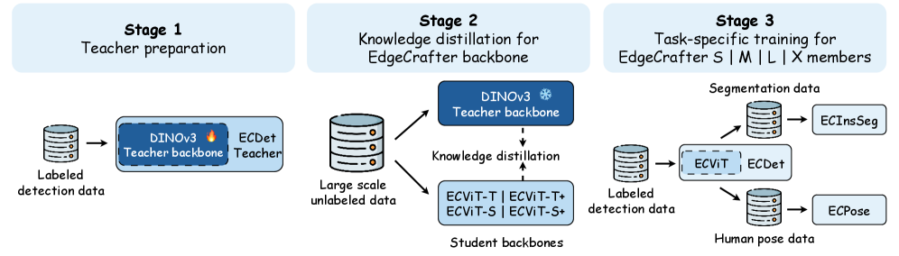
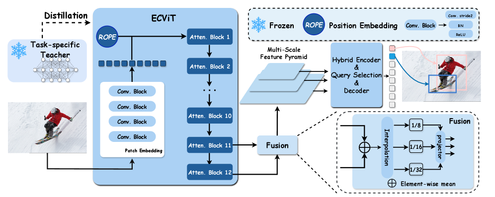

# 论文解读：EdgeCrafter: Compact ViTs for Edge Dense Prediction via Task-Specialized Distillation

**作者**：Longfei Liu, Yongjie Hou, Yang Li, Qirui Wang, Youyang Sha, Yongjun Yu, Yinzhi Wang, Peizhe Ru, Xuanlong Yu, Xi Shen
**机构**：Intellindust AI Lab
**arXiv**：2603.18739 | **日期**：2026年3月19日

---

## TLDR

EdgeCrafter 提出了一套面向边缘部署的紧凑 ViT 框架，通过任务特化蒸馏（task-specialized distillation）解决小型 ViT 在密集预测任务中表征不足的核心问题。在 COCO 数据集上，仅需 10M 参数的 ECDet-S 即可达到 51.7 AP 的检测精度；ECPose-X 以 74.8 AP 显著超越依赖 Objects365 预训练的 YOLO26Pose-X（71.6 AP），展示了紧凑 ViT 在边缘密集预测中的竞争力。

---

## 动机与发现

### 问题：紧凑 ViT 在边缘密集预测中的性能瓶颈

边缘设备部署密集预测模型（目标检测、实例分割、人体姿态估计）时，受计算和内存的严格限制。当前实践中，轻量级系统仍以 YOLO 等 CNN 架构为主，而紧凑 ViT 通常难以获得同等精度-效率权衡，即使使用大规模预训练也是如此。

### 关键发现

1. **通用预训练对紧凑 ViT 不够用**：实验发现，使用 ImageNet-21K 监督预训练初始化 ViT-Tiny，在密集预测任务上甚至比从头训练效果更差。这与 Ghiasi 等人（2021）和 Zoph 等人（2020）的观察一致。
2. **任务特化蒸馏显著提升下游性能**：将大型 DINOv3 预训练 ViT 先适配到目标检测，再作为教师进行特征对齐蒸馏，能将紧凑学生的下游性能提升到远超通用预训练的水平。
3. **检测蒸馏表征可直接迁移到其他任务**：同一个检测蒸馏后的 backbone 和 encoder，只需换轻量级任务头即可支持实例分割和姿态估计。

---

## 方法

*图2: EdgeCrafter 流水线概览。阶段一：将预训练 DINOv3 backbone 适配到目标检测，构建任务特化教师。阶段二：通过特征对齐将检测导向的表征蒸馏到紧凑 ECViT 学生 backbone。阶段三：蒸馏后的学生用于实例化不同尺度的 ECDet 模型家族，并复用到实例分割和人体姿态估计。*

**核心思想**

EdgeCrafter 以 ECDet 为核心检测模型，采用三阶段流水线：先将大模型适配为检测特化教师，再通过特征对齐蒸馏到紧凑学生 backbone，最后将同一 backbone 复用到密集预测的多个下游任务。

### ECDet 架构

*图3: ECDet 架构。ECDet 由三个组件组成：蒸馏后的 ECViT backbone、编码器和解码器。backbone 将标准的大步长 patch embedding 替换为四层卷积 stem，输出单分辨率 token 表征。轻量级多尺度特征生成器聚合最后两个 transformer 块，通过插值和 1x1 投影生成 stride 8/16/32 的特征图。编码器精炼并融合这些特征，解码器执行基于集合的目标预测。*

**Backbone 设计（ECViT）**

标准 ViT 的 patch embedding 使用单次大步长投影，会丢失对密集定位关键的精细空间信息。ECDet 用四层 3×3 卷积（stride 2）替代，逐步扩大感受野后再送入 transformer 块。这符合有效感受野分析中卷积堆叠保留中心集中感受野的特性。

**多尺度特征生成**

ViT 不自然产生层级特征金字塔。ECDet 取最后两个 transformer 块的输出 token，平均后 reshape 为 stride 16 的空间特征图，再通过双线性插值和 1×1 卷积投影生成 stride 8/16/32 的三级金字塔。该设计几乎不引入额外参数。

**编码器**

遵循 RT-DETR 的设计：先用 AIFI（注意力内尺度特征交互）精炼最低分辨率特征图扩大感受野，再用 CCFF（CNN 跨尺度特征融合）将高层语义传播到更细粒度尺度。

**解码器**

采用 DETR 集合预测范式，使用 4 层堆叠的自注意力 + 可变形交叉注意力 + FFN，操作 300 个学习到的对象查询。

**训练目标**

标准 DETR 风格的二部图匹配损失，包含分类损失（Varifocal Loss）和框回归损失（L1 + GIoU + DDF + FGL）。

**关键创新点：**
- 用轻量卷积 stem 替代标准 patch embedding，更适合密集定位
- 通过简单插值 + 线性投影构建多尺度特征，避免昂贵的 FPN 模块

### 任务特化蒸馏

**检测特化教师**

将预训练 DINOv3 ViT（通过添加与 ECDet 相同的检测头）适配为目标检测，使其表征与下游学生任务直接对齐。使用两个教师尺度：ECTeacher-S（来自 DINOv3-S）和 ECTeacher-B（来自 DINOv3-B）。

**特征对齐蒸馏**

学生 backbone 最后一个 transformer 块的 token 特征，通过单层线性适配器映射到教师特征维度，同时匹配教师最后两个块的特征：

$$\mathcal{L}_{\mathrm{distill}} = \sum_{l \in \{L-1, L\}} \|\phi(\mathbf{X}^S_L) - \mathbf{X}^T_l\|_2^2$$

使用最小化适配器将表征学习的负担放在学生 backbone 本身，而非允许高容量投影头吸收差异。

**蒸馏设置**

在下游任务适配之前先进行蒸馏。S 检测器从 ECTeacher-S 蒸馏，M/L/X 从 ECTeacher-B 蒸馏。蒸馏数据混合 ImageNet-1K 和 COCO 训练集图片，且教师先在 COCO 检测上微调以更贴近任务。

### ECPose 与 ECInsSeg

**ECPose**：复用 ECDet 的蒸馏 backbone 和 encoder，将检测头替换为轻量姿态头。遵循 DETRpose 的结构化查询设计，每个人体实例使用 1 个 instance token + K 个关键点 token。训练损失为 Varifocal 分类 + 关键点回归 + OKS 损失。

**ECInsSeg**：在 ECDet 检测头基础上增加轻量级 mask head。每个检测框的 RoI 特征经过 mask 解码器生成分割掩码。

---

## 实验设定与结果

### 实验配置

- **数据集**：COCO 2017
- **评估指标**：AP, AP50, AP75, APS, APM, APL
- **模型家族**：ECDet-S/M/L/X，输入分辨率统一 640×640
- **蒸馏数据**：ImageNet-1K + COCO 训练集
- **下游训练**：仅使用 COCO 任务标注，无需 Objects365 等额外预训练数据

### 核心结果

**目标检测**

| 模型 | 参数量 | GFLOPs | AP | AP50 | AP75 |
|------|--------|--------|-----|------|------|
| YOLOv9-S | 7M | 26 | 46.8 | 61.8 | 48.6 |
| YOLO11-S | 9M | 22 | 46.6 | 63.4 | 50.3 |
| D-FINE-S | 10M | 25 | 48.5 | 65.6 | 52.6 |
| DEIMv2-S | 10M | 26 | 50.9 | 68.4 | 55.1 |
| **ECDet-S** | **10M** | **26** | **51.7** | **69.4** | **55.8** |
| YOLOv9-M | 20M | 76 | 51.4 | 67.2 | 54.6 |
| YOLO26-M | 20M | 68 | 52.5 | 69.8 | 57.2 |
| **ECDet-M** | **18M** | **53** | **54.3** | **72.2** | **58.7** |
| D-FINE-L* | 31M | 91 | 54.0 | 71.6 | 58.4 |
| DEIMv2-L | 32M | 97 | 56.0 | 73.5 | 61.1 |
| **ECDet-L** | **31M** | **101** | **57.0** | **75.1** | **61.7** |
| RF-DETR-X* | 126M | 300 | 58.6 | 77.4 | 63.8 |
| YOLO26-X | 55M | 194 | 56.9 | 74.1 | 62.1 |
| **ECDet-X** | **49M** | **151** | **57.9** | **76.0** | **62.9** |

ECDet-S 在同等参数量下 AP 比 DEIMv2-S 高 0.8，比 YOLOv9-S 高 4.9。ECDet-X 以 49M 参数达到 RF-DETR-X（126M）近似的性能。

**人体姿态估计**

ECPose-X 达到 **74.8 AP**，显著超越 YOLO26Pose-X（71.6 AP）后者还使用了 Objects365 预训练。

**实例分割**

ECInsSeg 在参数量远少于 RF-DETR-Seg 的情况下达到可比性能。

---

## 启示和结论

### 主要贡献

1. **识别了紧凑 ViT 在边缘密集预测中的关键瓶颈**：通用监督预训练对小型模型往往不够，任务特化表征学习才是核心问题。
2. **提出面向边缘的紧凑 ViT 设计**：结合任务特化蒸馏、轻量卷积 stem 和简单多尺度特征构建，使 ViT backbone 在严格参数和 FLOP 预算下适合密集预测。
3. **引入统一框架 EdgeCrafter**：以 ECDet 为核心的检测蒸馏表征可有效迁移到实例分割和人体姿态估计，保持跨任务的精度-效率权衡。

### 理论意义

- 大模型的通用预训练表征并不能自动传递到紧凑模型，任务特化蒸馏桥接了这一差距。
- 检测作为表征学习阶段，学到的 backbone 可直接服务于其他密集预测任务，验证了检测在密集预测中的核心地位。

### 实践价值

- 为边缘部署提供了比 YOLO 更具竞争力的 ViT 替代方案
- 无需 Objects365 等大规模额外预训练数据，仅用 COCO 标注即可达到 SOTA 级别性能
- 统一框架降低了同时部署检测、分割、姿态估计系统的工程复杂度

### 局限性

- 延迟方面，ECDet-S 的 TensorRT 推理延迟（5.41ms）略高于 YOLOv10-S（2.52ms）和 YOLO26-S（2.59ms），CNN 方案在纯推理速度上仍有优势
- 蒸馏阶段需要先训练大型教师模型，增加了整体训练成本

---

**代码**：https://intellindust-ai-lab.github.io/projects/EdgeCrafter/
