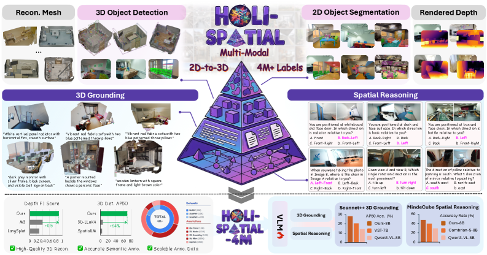
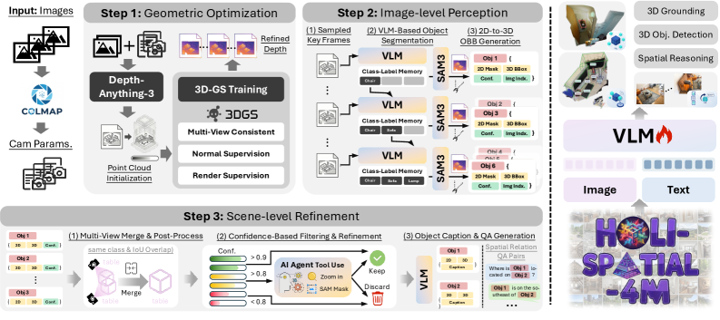
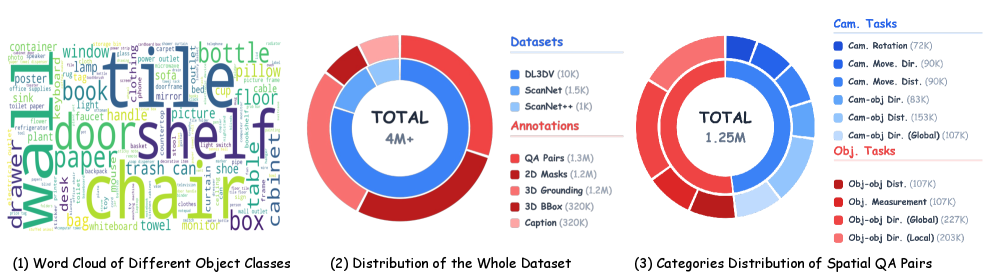

# 论文解读：Holi-Spatial: Evolving Video Streams into Holistic 3D Spatial Intelligence

**作者**：Yuanyuan Gao, Hao Li, Yifei Liu, Xinhao Ji, Yuning Gong, Yuanjun Liao, Fangfu Liu, Manyuan Zhang, Yuchen Yang, Dan Xu, Xue Yang, Huaxi Huang, Hongjie Zhang, Ziwei Liu, Xiao Sun, Dingwen Zhang, Zhihang Zhong

**机构**：上海AI Lab、西北工业大学、上海交通大学、北京大学、南洋理工大学、北京航空航天大学、四川大学、清华大学、香港中文大学、复旦大学、香港科技大学

**arXiv**：2603.07660 | **日期**：2026年3月8日

---

## TLDR

Holi-Spatial是首个全自动、大规模、空间感知的多模态数据集构建管道，能将原始视频流转换为高保真3D几何结构和全面的空间标注，无需人工干预。基于此管道构建的Holi-Spatial-4M数据集包含12K优化的3DGS场景、130万2D掩码、32万3D边界框、120万3D定位实例和120万空间问答对。在ScanNet++上，微调Qwen3-VL后3D定位AP50提升15%，MMSI-Bench准确率提升7.9%。

*图1: Holi-Spatial是首个全自动管道，能够将原始视频流转换为全面的3D空间标注，无需人工干预。相比现有方法，Holi-Spatial在ScanNet上多视图深度估计提升0.5 F1，3D检测AP50提升64%。基于此构建的Holi-Spatial-4M数据集有效赋能视觉语言模型，微调Qwen3-VL后在ScanNet++上3D定位AP50提升15%，MMSI-Bench准确率提升7.9%。*

---

## 动机与发现

### 问题：空间智能数据的稀缺与不平衡

空间智能是让大模型理解真实3D世界的基础，但现有方法面临关键瓶颈：
- **数据稀缺**：现有空间数据集主要依赖少量人工标注的3D数据集（如ScanNet、ScanNet++），难以规模化扩展
- **语义覆盖有限**：ScanNet仅标注50个类别，无法覆盖真实世界的丰富语义
- **领域偏差**：窄范围数据集导致模型泛化能力受限

### 关键发现

1. **AI工具组合潜力**：通过系统组合Depth-Anything-V3、SAM3、VLM等AI工具，可以构建自动化的空间标注引擎，甚至超越人工标注质量
2. **多视图一致性**：3DGS优化后的深度图比单目深度估计更具多视图一致性，能有效消除浮点噪声
3. **2D到3D提升的挑战**：直接从2D掩码反投影到3D会产生边界误差和深度不连续噪声，需要几何感知过滤策略
4. **置信度与召回率的权衡**：高置信度过滤提升精度但降低召回率，VLM Agent验证可恢复低置信度真阳性

---

## 方法

**核心思想**

Holi-Spatial采用三阶段流水线：几何优化→图像级感知→场景级精炼，将原始视频流转换为高质量3D标注。

*图3: Holi-Spatial管道概览。框架分三阶段：(1)几何优化通过3DGS从视频流中提炼高保真3D结构；(2)图像级感知将2D VLM和SAM3预测提升为初始3D提议；(3)场景级精炼采用粗到细策略合并、验证和标注实例，生成密集高质量空间标注。最后基于Holi-Spatial-4M数据集直接微调Qwen-VL系列用于下游任务。*

### 阶段1：几何优化

**目标**：从原始视频流中提炼高保真几何结构，作为空间标注的基础。

**流程**：
1. 使用Structure-from-Motion恢复精确的相机内参和外参
2. 利用Depth-Anything-V3初始化密集点云
3. 通过3DGS进行逐场景优化，集成几何正则化以确保多视图深度一致性
4. 消除大尺度浮点噪声，产生干净一致的场景表示

**关键创新点：**
- 结合表面重建3DGS方法的几何正则化，强制多视图深度一致性
- 优化后的深度图可渲染出物理表面一致的高质量深度

### 阶段2：图像级感知

**目标**：从关键帧中提取空间一致的对象标签和高质量2D掩码。

**流程**：
1. 从视频流中均匀采样关键帧
2. 使用Gemini3-Pro为每帧生成描述
3. 维护动态类别标签内存，确保语义一致性
4. 基于内存中的标签，使用SAM3进行开放词汇实例分割
5. 将2D掩码反投影到3D空间，生成初始3D边界框提议

**2D到3D提升的几何感知过滤：**
- **掩码腐蚀**：缓解SAM3在物体轮廓附近的边界误差
- **网格引导深度过滤**：消除深度不连续导致的3D离群点
- **地板对齐后处理**：估计全局上轴，重新定向每个实例的垂直轴

**关键创新点：**
- 动态类别标签内存确保跨帧语义一致性
- 几何感知过滤策略同时处理2D边界误差和3D深度噪声

### 阶段3：场景级精炼

**目标**：通过粗到细策略从噪声初始提议中提炼高保真标注。

**核心组件：**

1. **多视图合并与后处理**
   - 空间聚类合并冗余检测（IoU3D > 0.2）
   - 保留最高置信度的源图像用于后续VLM标注
   - 全局地板对齐，确保几何一致性

2. **置信度过滤与精炼**
   - 三级决策规则：高置信度(≥0.9)保留，低置信度(<0.8)丢弃，中间带(0.8-0.9)交由VLM Agent验证
   - VLM Agent配备图像放大和SAM3重新分割工具
   - 平衡精度与召回率

3. **语义标注生成**
   - 使用Qwen3-VL-30B为每个验证实例生成细粒度描述
   - 基于预定义模板程序化生成空间QA对，覆盖3D定位、空间推理、属性识别等任务

**关键创新点：**
- VLM Agent验证机制恢复被错误过滤的低置信度真阳性
- 结合置信度过滤和Agent验证实现最佳精度-召回率平衡

---

## 实验设定与结果

### 实验配置

- **数据集**：ScanNet、ScanNet++、DL3DV-10K
- **评估指标**：
  - 深度估计：F1-score
  - 2D分割：IoU
  - 3D检测：AP@25、AP@50
  - 3D定位：AP@15、AP@25、AP@50
  - 空间推理：准确率
- **微调设置**：使用120万空间QA对微调Qwen3-VL系列，1个epoch，batch size 1024，32块H800 GPU

### 核心结果

#### 数据构建质量评估

| 方法 | ScanNet | ScanNet++ | DL3DV |
|------|---------|-----------|-------|
| | Depth F1 | 2D Seg IoU | 3D Det AP50 | Depth F1 | 2D Seg IoU | 3D Det AP50 | Depth F1 | 2D Seg IoU | 3D Det AP50 |
| SAM3 | - | 0.63 | - | - | 0.50 | - | - | 0.66 | - |
| M3-Spatial | 0.32 | 0.22 | - | 0.39 | 0.11 | - | 0.23 | 0.13 | - |
| LLaVA-3D | - | - | 6.86 | - | - | 4.80 | - | - | 4.11 |
| **Holi-Spatial** | **0.98** | **0.66** | **67.00** | **0.89** | **0.64** | **70.05** | **0.78** | **0.71** | **52.67** |

Holi-Spatial在所有数据集和指标上均显著优于基线方法：
- ScanNet++深度F1：0.89 vs M3-Spatial 0.39（提升128%）
- ScanNet++ 3D检测AP50：70.05 vs LLaVA-3D 4.80（提升1360%）

#### VLM微调效果

**空间推理（MMSI-Bench / MindCube）：**
- Qwen3-VL-2B：26.1 / 33.5 → 27.6 / 44.0（+1.5 / +10.5）
- Qwen3-VL-8B：31.1 / 29.4 → 32.6 / 49.1（+1.5 / +19.7）

**3D定位（ScanNet++）：**
- Qwen3-VL-8B：AP50 13.50 → 27.98（+14.48，提升107%）

*图6: Holi-Spatial-4M综合统计。(1)对象多样性：开放词汇类别的长尾分布词云。(2)数据集组成：内环显示来源场景（ScanNet、ScanNet++、DL3DV），外环详细说明超过400万生成的空间标注。(3)空间QA分类：125万空间QA对的分布，分为相机中心任务（如旋转、移动）和对象中心任务（如距离、方向）。*

---

## 启示和结论

### 主要贡献

1. **首个全自动空间标注管道**：Holi-Spatial无需人工干预，将原始视频转换为高质量3D几何和全面的空间标注
2. **大规模高质量数据集**：Holi-Spatial-4M包含12K 3DGS场景、400万+标注，覆盖开放词汇语义
3. **显著的下游任务提升**：微调VLM后在3D定位和空间推理任务上取得大幅改进
4. **统一的多任务框架**：同时支持深度估计、2D分割、3D检测、3D定位、空间QA等多种空间任务

### 理论意义

- 证明了通过系统组合现有AI工具可以构建超越人工标注的自动化数据引擎
- 多视图几何一致性是高质量3D标注的关键
- 几何与语义先验的协同作用可补偿单图像观察的不完整性

### 实践价值

- 管道完全自动化，可随资源增加进一步扩展
- 开放词汇标注覆盖真实世界的丰富语义
- 为机器人操作、导航、场景编辑、增强现实等应用提供数据基础

### 局限性

- 管道依赖多个上游组件和逐场景优化，计算成本较高
- 在挑战性视频下（有限视角、运动模糊、严重遮挡、动态物体）可能退化
- 开放词汇语义标注可能继承基础模型的偏差或错误
- 需要进一步改进效率（如自适应早停、更好的置信度验证）

---

**代码**：https://github.com/Visionary-Laboratory/Holi-Spatial

**项目主页**：https://visionary-laboratory.github.io/holi-spatial/
