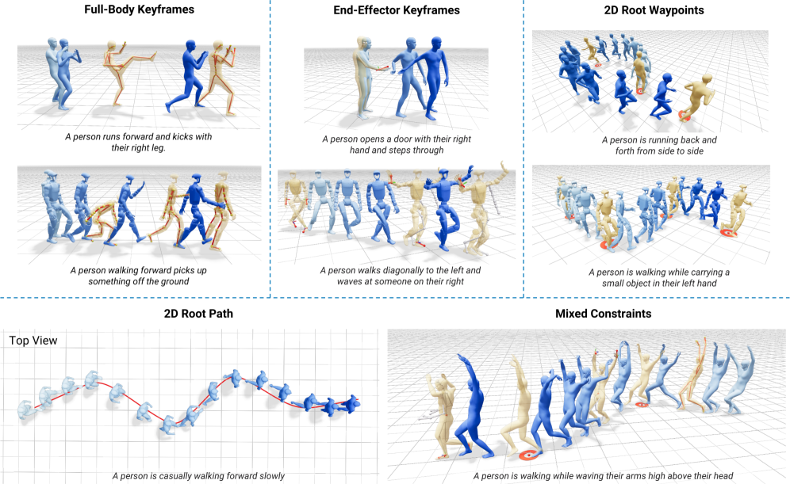
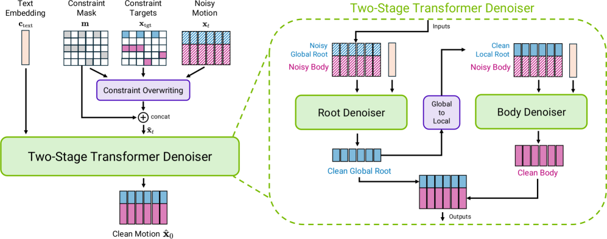

# 论文解读：Kimodo: Scaling Controllable Human Motion Generation

**作者**：Davis Rempe*, Mathis Petrovich*, Ye Yuan, Haotian Zhang, Xue Bin Peng, Yifeng Jiang, Tingwu Wang, Umar Iqbal, David Minor, Michael de Ruyter, Jiefeng Li, Chen Tessler, Edy Lim, Eugene Jeong, Sam Wu, Ehsan Hassani, Michael Huang, Jin-Bey Yu, Chaeyeon Chung, Lina Song, Olivier Dionne, Jan Kautz, Simon Yuen, Sanja Fidler
**机构**：NVIDIA
**arXiv**：2603.15546 | **日期**：2026年3月16日

---

## TLDR

Kimodo 是 NVIDIA 提出的可控人体运动生成扩散模型，在 700 小时专业光学动作捕捉数据上训练，支持文本提示和多种运动学约束（全身关键帧、稀疏关节位置/旋转、2D 路径点、密集路径）。其两阶段去噪器架构将根运动与身体运动分解预测，在控制精度上达到全身关键帧 2.67cm 误差、末端执行器 3.09cm 位置误差，可直接用于机器人演示数据生成。

*图1: 可控运动生成。Kimodo 通过文本提示结合广泛的运动学约束套件支持灵活直观的运动生成。通过在 700 小时光学动作捕捉数据上训练，模型在大量行为上实现了精确的控制精度。*

---

## 动机与发现

### 问题：高质量可控人体运动数据获取困难

机器人、仿真和娱乐领域对高质量人体运动数据需求日益增长。传统方法（手动动画、光学动捕、遥操作、视频重建）各有缺陷：手动动画耗时且需专业知识，光学动捕昂贵且设备要求高，遥操作生成动作不自然，视频重建精度不足。现有生成模型受限于公开数据集规模小（如 HumanML3D 仅 30 小时），导致运动生成质量、控制精度和泛化能力受限。

### 关键发现

1. **数据规模至关重要**：使用 700 小时专业动捕数据训练，显著提升约束跟随能力和运动质量。当数据量降至 10%（约 70 小时，与常见数据集规模相当）时，脚部滑动和约束误差明显增加。

2. **两阶段分解架构有效**：将根运动和身体运动分开预测（两阶段 Transformer），比单阶段架构显著减少脚部滑动（从 7.59 cm/s 降至 3.87 cm/s）。

3. **平滑根表示优于直接骨盆投影**：使用平滑根轨迹而非直接骨盆投影，能更好地模拟动画工具中的平滑曲线，减少脚部滑动。

4. **规模定律成立**：数据规模、模型规模和批大小三个维度的扩展均能提升性能，其中数据规模主要改善约束跟随，模型规模和批大小主要改善文本跟随和运动质量。

---

## 方法

**核心思想**

Kimodo 采用显式运动扩散模型，通过精心设计的运动表示和两阶段 Transformer 去噪器，在保持运动生成质量的同时实现精确的运动学约束控制。

### 运动表示

每个姿态由以下特征向量表示：
- **平滑全局根位置** 𝐫ᵖ：对骨盆位置的水平分量(x,z)进行强平滑，保持 y 高度不变
- **全局根朝向** 𝐫ᵃ：使用 [cos(ψ), sin(ψ)] 表示
- **关节位置** 𝐣ᵖ：水平分量相对于平滑根位置，y 高度为全局值（不相对于根朝向规范化）
- **全局关节速度** 𝐣ᵛ：从全局关节位置计算
- **全局关节角度** 𝐣ᵃ：使用 6D 旋转表示
- **脚部接触标志** 𝐟：4 个布尔值

**设计要点：**
- 采用全局表示，支持稀疏约束的直接植入（imputation）
- 关节位置不相对于根朝向规范化，避免翻转动作导致的表示不连续
- 全局关节旋转表示支持世界空间中的旋转约束
- 平滑根轨迹模拟动画工具中的平滑曲线

### 两阶段 Transformer 去噪器

*图9: 去噪器架构。(左) Kimodo 根据噪声运动、姿态约束和文本嵌入预测干净运动。(右) 两阶段去噪器将根运动和身体运动分解预测。*

**架构设计：**
1. **根去噪器**（第一阶段）：预测全局根运动 𝐫̂⁰ᵍˡᵒᵇ，输入为完整噪声运动
2. **身体去噪器**（第二阶段）：预测身体运动 𝐛̂⁰，输入为局部根表示 + 身体特征

**约束条件处理：**
- 约束通过直接植入（imputation）覆盖噪声运动输入
- 控制掩码与运动特征拼接作为最终输入

**条件信号：**
- 文本嵌入：使用 LLM2Vec（4096维），优于 CLIP 和 T5
- 初始朝向 token 𝐜ᵈⁱʳ
- 额外的 "register" token（49 个全零 token）增强表示能力

**关键创新点：**
- **两阶段交错去噪**：每步去噪同时预测根和身体运动（不同于先前方法的完全顺序处理）
- **局部根表示用于第二阶段**：使用根角速度、平面平移速度和绝对高度，提供更好的不变性
- **全局旋转表示**：支持世界空间旋转约束，训练时随机化初始朝向
- **额外 register token**：增强模型表示能力，改善文本跟随和运动质量

### 训练策略

**双阶段训练课程：**
- **阶段 1**（前 500k 步）：纯文本到运动生成训练
- **阶段 2**（后 500k 步）：混合文本和运动学约束训练，约束模式包括全身关键帧、末端执行器、2D 路径等

**数据增强：**
- 文本：使用 Qwen3-32B 进行释义，生成一致的提示结构
- 运动：随机拼接运动片段，使用扩散模型生成过渡动作

**训练细节：**
- DDPM 框架，1000 扩散步
- Adam-atan2 优化器，学习率 2e-5
- EMA 衰减 0.995
- 最佳配置：2048 批大小，16×A100 GPU

### 运动生成

- 使用 DDIM 推理，默认 100 去噪步
- 分解式无分类器指导：分别控制文本和约束条件的影响权重
- 多提示序列：通过重叠区域添加全身关键帧约束实现平滑过渡
- 后处理：脚部锁定 + IK 清理滑动，优化确保精确命中约束

---

## 实验设定与结果

### 实验配置

- **数据集**：Bones Rigplay（700 小时专业动捕数据，170 名受试者，27 关节骨架）
- **评估指标**：
  - 文本跟随：Top-3 R-precision（R@3），使用 TMR 嵌入模型
  - 运动质量：FID（基于 TMR）
  - 脚部滑动：静态接触帧中脚关节平均速度
  - 约束精度：约束帧处关节位置/旋转误差

### 核心结果

**完整模型 vs 基线对比：**

| 方法 | R@3↑ | FID↓ | 滑动(cm/s)↓ | 全身Pos(cm)↓ | 末端Pos(cm)↓ | 末端Rot(deg)↓ | 2D根Pos(cm)↓ |
|------|------|------|-------------|--------------|--------------|---------------|--------------|
| Ground Truth | 75.6 | 0.0 | 2.21 | - | - | - | - |
| **完整模型** | **71.9** | **1.85** | **3.87** | **2.67** | **3.09** | **4.18** | **2.90** |
| 单阶段架构 | 71.5 | 1.65 | 7.59 | 8.37 | 10.19 | 5.19 | 7.74 |
| 第二阶段全局 | 70.3 | 1.87 | 4.17 | 2.97 | 3.39 | 5.67 | 3.25 |
| 无平滑根 | 71.6 | 1.75 | 4.39 | 2.68 | 3.19 | 3.93 | 3.21 |
| 无额外token | 70.9 | 1.95 | 4.28 | 2.40 | 2.59 | 5.55 | 2.85 |
| 无训练课程 | 71.3 | 1.84 | 3.92 | 5.80 | 6.59 | 4.34 | 5.71 |

**缩放分析：**
- **数据规模**：从 10% 到 100% 数据，脚部滑动从 5.28 降至 4.23 cm/s，全身约束误差从 4.60 降至 2.77 cm
- **模型规模**：从 S(56M) 到 L(282M)，R@3 从 64.0 提升至 71.9，FID 从 3.10 降至 1.85
- **批大小**：从 4 GPU 到 16 GPU，R@3 从 69.4 提升至 73.6，FID 从 2.01 降至 1.61

---

## 启示和结论

### 主要贡献

1. **大规模高质量数据训练**：首次在 700 小时专业光学动捕数据上训练运动扩散模型，证明数据规模对控制精度的关键作用

2. **两阶段分解去噪器**：将根运动与身体运动分开预测，交错去噪，显著减少脚部滑动等常见伪影

3. **全面的运动学约束支持**：通过全局运动表示和直接植入，支持全身关键帧、稀疏关节位置/旋转、2D 路径等多种约束，无需额外 ControlNet 微调或测试时优化

4. **机器人应用验证**：成功应用于 Unitree G1 机器人演示数据生成，通过重定向可直接用于人形机器人控制

### 理论意义

- 证明了运动生成领域的规模定律：数据规模、模型规模和计算规模均能提升性能
- 全局运动表示相比局部表示在稀疏约束控制上具有优势
- 两阶段交错去噪优于完全顺序去噪

### 实践价值

- 提供了开源模型（SOMA 人体骨架和 Unitree G1 机器人版本）
- 交互式运动编辑界面，降低动画制作门槛
- 可快速生成机器人演示数据（几秒内完成），替代昂贵的遥操作

### 局限性

- 模型为"离线"设计，单次生成需 2-5 秒，不适合实时控制
- 仅训练在动捕数据上，未利用互联网视频数据进行扩展
- 缺乏场景和物体交互能力
- 训练序列最大长度限制为 10 秒

---

**代码**：https://github.com/nv-tlabs/kimodo
**项目页面**：https://research.nvidia.com/labs/sil/projects/kimodo/
