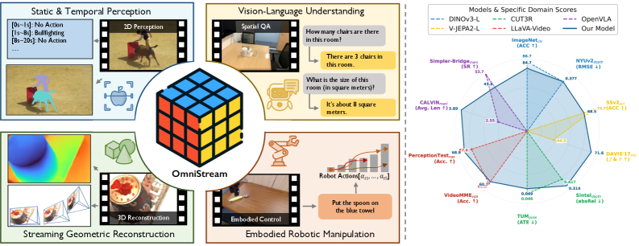
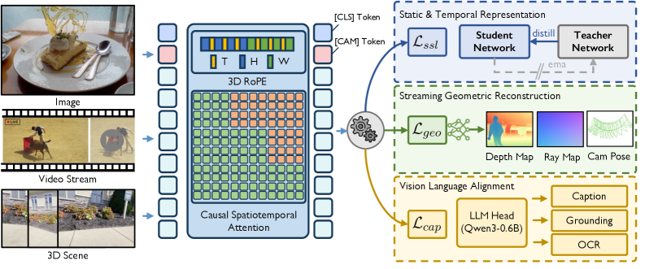
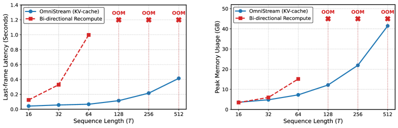

# 论文解读：OmniStream: Mastering Perception, Reconstruction and Action in Continuous Streams

**作者**：Yibin Yan, Jilan Xu, Shangzhe Di, Haoning Wu, Weidi Xie
**机构**：上海交通大学人工智能学院、上海创新研究院、牛津大学VGG
**arXiv**：2603.12265 | **日期**：2026年3月12日

---

## TLDR

OmniStream提出了一种统一的流式视觉骨干网络，通过引入因果时空注意力和3D旋转位置编码（3D-RoPE），将预训练的图像ViT转化为在线流式模型。该模型在29个数据集上进行多任务预训练，即使骨干网络完全冻结，也能在图像/视频感知、流式几何重建、视频空间推理和机器人操作等任务上取得与专门专家模型相当的性能。


*图1: 左：OmniStream支持广泛的任务，包括2D/3D感知、视觉语言理解和具身机器人操作。右：冻结的单骨干网络特征与领先的领域专家模型相比，实现了高度竞争或更优的性能。*

---

## 动机与发现

### 问题：如何构建通用流式视觉表示？

当前视觉基础模型呈现碎片化状态：
- 图像编码器（DINO、SigLIP）专注于静态语义
- 视频模型（V-JEPA、VideoMAE）处理离线时序
- 几何专家（DepthAnything、VGGT）关注空间结构

这些模型难以在单一骨干网络中统一静态语义、时序动态和3D结构，尤其是在在线因果场景下。

### 关键发现

1. **因果视频建模对捕捉动态运动至关重要**：移除视频SSL导致SSv2下降6.3%，CALVIN下降0.38
2. **显式几何预训练是具身AI的前提**：禁用3D重建导致VSI-Bench下降4.8%，CALVIN下降0.46
3. **早期视觉语言对齐防止VLM集成时的灾难性失败**：移除字幕任务导致VideoMME下降9.1%，VSI-Bench下降12.4%
4. **多任务协同效应远超简单叠加**：语义、动态和几何目标相互增强，形成鲁棒表示

---

## 方法


*图2: OmniStream整体框架。配备3D-RoPE和因果时空注意力，通过多任务框架训练统一骨干网络，耦合静态和时序表示学习、流式几何重建和视觉语言对齐。*

**核心思想**

将DINOv3图像ViT转化为流式视觉骨干网络：
1. **因果时空注意力**：实现严格时序因果性，支持KV-cache逐帧在线推理
2. **3D旋转位置编码（3D-RoPE）**：将2D RoPE扩展到时空域，采用2:3:3的(t,y,x)分配策略

### 1. 问题形式化

给定连续视频流 V^T = {I_1, I_2, ..., I_T}，骨干网络在时间步t处理当前帧和历史上下文，产生复合输出状态O_t，严格约束O_t不依赖未来帧。

### 2. 流式视觉骨干网络

**架构修改：**
- 输入：每帧分割为p×p不重叠patch，添加特殊token（[CLS]、[vision_registers]、[CAM]）
- 因果时空注意力：应用因果时序掩码，token在时间t只能关注时间≤t的token
- KV-cache机制：增量推理，复用缓存的K/V，避免重复计算

**3D-RoPE设计：**
- 维度分配：时间:高度:宽度 = 2:3:3
- 时序分量交错到原始2D RoPE中
- 应用RoPE-box jittering提高鲁棒性

### 3. 统一多任务学习目标

**总损失函数：**
```
L_total = λ_ssl·L_ssl + λ_geo·L_geo + λ_cap·L_cap
```
其中 λ_ssl=0.1, λ_geo=λ_cap=1

**目标组成：**

1. **静态和时序表示学习（L_ssl）**
   - DINO损失：全局语义一致性
   - iBOT损失：patch级判别特征
   - KoLeo正则化：特征空间均匀分布
   - Gram锚定：训练过程中patch级特征一致性

2. **流式几何重建（L_geo）**
   - 深度头（dual-DPT）：预测深度图D̂和光线图R̂
   - 相机头（轻量MLP）：预测相机姿态ĝ
   - 损失组成：L_depth + L_ray + L_points + L_camera
   - 深度预测使用置信度加权的L1回归

3. **视觉语言对齐（L_cap）**
   - 附加MLP投影器和轻量自回归语言解码器（Qwen3-0.6B）
   - 在字幕、OCR、视觉接地任务上训练
   - 梯度回传到视觉骨干，注入细粒度语义监督

**关键创新点：**
- 将图像视为T=1的退化流，统一图像和视频目标
- 200M帧数据预训练（29个数据集），包括图像、视频、3D/4D场景和字幕
- 因果掩码设计使每个样本提供1到T帧的不同时序上下文监督

### 4. 下游应用统一表示

**评估范式：骨干网络严格冻结，仅训练任务特定模块**

- **感知（图像/视频）**：在冻结特征上训练线性/注意力探针
- **推理（VLM）**：MLP投影器将视觉token映射到语言嵌入空间，LLM生成文本
- **动作（VLA）**：在LLM输出上附加MLP动作专家，预测机器人动作

---

## 实验设定与结果

### 实验配置

- **骨干网络**：DINOv3 ViT-L（400M参数）
- **训练数据**：约200M帧，29个数据集
- **训练设置**：
  - 64× NVIDIA H200 GPU
  - 两阶段训练：Stage-1（224×224，60K步）、Stage-2（512×512，120K步）
  - Adam优化器，峰值学习率1×10^-4，4K步warmup+余弦退火
  - 多帧序列长度T=16

### 核心结果

**图像和视频感知（骨干冻结）：**

| 基准 | OmniStream | DINOv3-L | V-JEPA2-L |
|------|------------|----------|-----------|
| ImageNet（分类） | 84.7% | 86.7% | - |
| NYUv2（深度） | 0.377 | 0.377 | - |
| ADE20K（分割） | 49.1% | 51.5% | - |
| SSv2（动作） | **68.5%** | 54.0% | 73.7% |
| K400（动作） | **85.7%** | 83.6% | 85.1% |
| DAVIS'17（VOS） | 71.6 | 73.2 | 44.2 |

**流式几何重建（vs CUT3R）：**

| 方法 | 参数 | Sintel深度↓ | BONN深度↓ | KITTI深度↓ | ScanNet姿态↓ |
|------|------|-------------|-----------|------------|--------------|
| CUT3R | 600M | 0.421 | 0.078 | 0.118 | 0.099 |
| OmniStream | 400M | **0.314** | **0.072** | 0.136 | **0.076** |

**VLM空间推理（VSI-Bench）：**

| 方法 | 平均分 | 绝对距离 | 相对距离 | 路线规划 |
|------|--------|----------|----------|----------|
| LLaVA-Video-7B | 35.6 | 14.0 | 42.4 | 34.0 |
| SpaceMind | 69.6 | 61.4 | 88.4 | 44.3 |
| **OmniStream-7B** | **70.6** | **55.7** | **82.1** | **45.4** |

**VLA机器人操作（冻结视觉）：**

| 方法 | CALVIN↑ | Simpler-Bridge↑ |
|------|---------|-----------------|
| Qwen2.5VL-7B | 2.905 | 18.5% |
| LLaVA-Video-7B | 2.898 | 30.2% |
| **OmniStream-7B** | **3.885** | **45.8%** |

### 消融研究

| 配置 | SSv2 | DAVIS'17 | ImageNet | NYUv2 | VSI-Bench | CALVIN |
|------|------|----------|----------|-------|-----------|--------|
| 完整模型 | 69.3% | 71.6 | 85.2% | 0.379 | 57.3% | 3.80 |
| w/o VideoSSL | 63.0% | 67.7 | 85.4% | 0.420 | 57.9% | 3.42 |
| w/o 3D Geometry | 68.4% | 69.7 | 85.0% | 0.471 | 52.5% | 3.34 |
| w/o Captioning | 67.4% | 71.0 | 84.4% | 0.395 | 44.9% | 2.38 |

**计算效率（KV-cache vs 全重计算）：**

| 上下文长度T | 16 | 32 | 64 | 128 | 256 | 512 |
|-------------|----|----|----|----|-----|-----|
| 全重计算延迟 | 0.125s | 0.329s | 0.998s | OOM | OOM | OOM |
| OmniStream延迟 | 0.042s | 0.057s | 0.067s | 0.115s | 0.216s | 0.414s |


*图3: Sintel视频深度重建的定性结果。我们的模型在长序列上保持时序一致性。*

---

## 启示和结论

### 主要贡献

1. **统一流式视觉骨干**：首次将因果时空注意力和3D-RoPE结合，在单一骨干中统一静态语义、时序动态和3D几何
2. **多任务协同预训练**：在29个数据集上耦合SSL、几何重建和语言对齐，证明多目标协同效应远超简单叠加
3. **严格冻结的通用性**：骨干冻结时在感知、推理、动作任务上均取得竞争性性能
4. **高效流式推理**：KV-cache实现O(T)时序复杂度，支持110帧零样本长度外推

### 理论意义

- 证明了单一视觉骨干可同时支持语义、空间和时序推理
- 早期视觉语言对齐对VLM集成至关重要
- 显式几何编码是具身AI的必要条件

### 实践价值

- 降低多任务部署的计算和存储开销
- 支持实时流式处理，适用于机器人、AR/VR等场景
- 统一表示简化下游任务集成

### 局限性

- 未在所有基准上超越专门的最先进方法
- 模型规模扩展作为未来方向
- 几何重建性能在某些数据集上略逊于专门3D专家

---

**代码**：https://github.com/Go2Heart/OmniStream
**项目页面**：https://go2heart.github.io/omnistream
