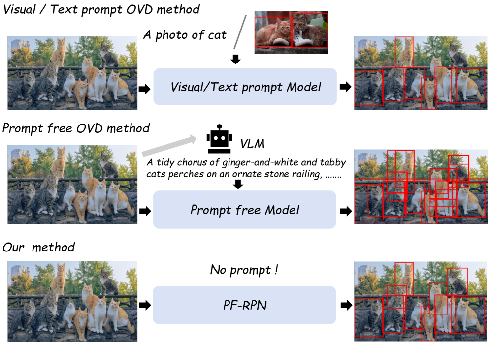
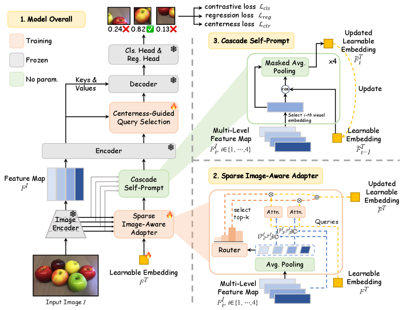
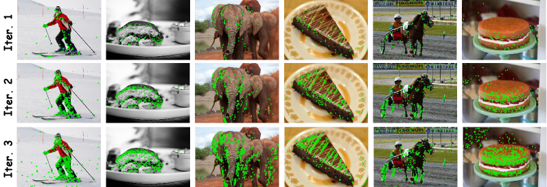
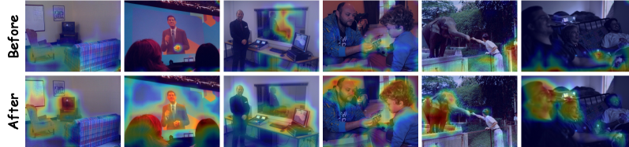
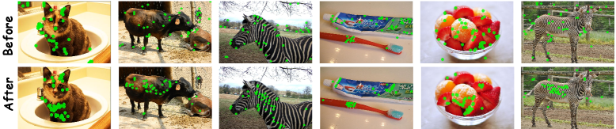

# 论文解读：Prompt-Free Universal Region Proposal Network

**作者**：Qihong Tang, Changhan Liu, Shaofeng Zhang, Wenbin Li, Qi Fan, Yang Gao
**机构**：南京大学，中国科学技术大学
**arXiv**：2603.17554 | **日期**：2026年3月18日

---

## TLDR

本文提出了一种无需外部提示的通用区域建议网络（PF-RPN），可在跨域场景中零样本识别任意潜在物体。核心创新包括稀疏图像感知适配器、级联自提示机制和中心性引导查询选择，仅需5% COCO数据训练，在19个跨域数据集上比现有方法提升6.0-7.5 AR。

*图1: 现有视觉/文本提示方法通常依赖预定义类别或示例图像来定位物体，而无提示方法需要生成文本描述，带来较大延迟。本文PF-RPN无需任何外部提示，仅利用视觉特征生成高质量建议框。*

---

## 动机与发现

### 问题：如何在无外部提示下识别任意物体？

现有方法存在明显局限：
- **依赖文本/视觉提示**：需要预定义类别或示例图像，在工业缺陷检测、水下目标检测等实际场景中难以获取
- **计算成本高**：基于生成式VLM的无提示方法引入巨大内存和延迟开销
- **泛化能力受限**：现有RPN方法在未见域上表现不佳

### 关键发现

1. **视觉特征比文本更适合定位**：用可学习嵌入替代文本嵌入，能更好地捕获物体视觉特征
2. **物体内部特征优于可学习嵌入**：物体内部特征具有更强的定位能力，可用于迭代检索其他物体
3. **中心查询生成更精确的边界框**：靠近物体中心的查询比边界查询产生更准确的建议框

---

## 方法

**核心思想**

PF-RPN构建在强大的OVD模型基础上，通过可学习视觉嵌入聚合信息，消除手动提示需求。核心是让模型"自问自答"：先用初始嵌入定位显著物体，再用已定位物体的特征检索剩余物体。

*图2: PF-RPN整体架构，包含三个核心组件：(1)稀疏图像感知适配器(SIA)通过路由机制和交叉注意力自适应整合多级特征；(2)级联自提示(CSP)通过多级视觉特征迭代精炼嵌入；(3)中心性引导查询选择(CG-QS)基于中心性分数解码最终预测。*

### 稀疏图像感知适配器（SIA）

**设计原理**：不同尺度的物体对应不同的特征级别，浅层特征利于小物体，深层特征利于大物体。

**工作机制**：
1. 对多级特征图进行全局平均池化，得到紧凑特征 $\bar{F}^i_I$
2. MoE路由器预测各特征级别的重要性权重 $w_i = \text{Router}(\bar{F}^i_I)$
3. 选择权重最高的top-k个特征级别（k=2）
4. 可学习嵌入 $F_T$ 作为查询，选中的特征作为键值对进行交叉注意力

**公式**：
$$\tilde{F}^T = \sum_{j=1}^{k} \tilde{w}_{\sigma(j)} \cdot \text{Attn}(F_T, [\bar{F}^I_{\sigma(j)}, F^I_{\sigma(j)}])$$

**关键创新点：**
- 使用MoE路由器稀疏选择特征级别，避免冗余信息
- 同时利用全局和局部特征，融合粗粒度和细粒度信息
- 将文本嵌入替换为图像派生表示，桥接模态差异

### 级联自提示（CSP）

**设计原理**：单步适配不足，物体内部特征能更好地定位其他物体。

**工作机制**：
1. 从深层到浅层迭代：先聚合高层语义，再整合细节结构
2. 在每个级别生成相似性掩码：$M_i = \mathbb{1}(\cos(\tilde{F}^T_{i-1}, F^I_i) > \delta)$（δ=0.3）
3. 通过掩码平均池化更新嵌入：$\tilde{F}^T_i = \tilde{F}^T_{i-1} + \text{MAP}(M_i, F^I_i)$
4. 设置迭代次数为3次，在精度和效率间取得平衡

**关键创新点：**
- 自提示机制：无需外部提示，用已激活的视觉特征指导嵌入精炼
- 深层到浅层级联：先获取语义一致性，再保留结构细节
- 渐进式检索：逐步扩展物体一致激活，抑制背景噪声

*图3: 级联自提示模块不同迭代次数的区域选择可视化。绿色点表示当前迭代选中的物体区域。随着迭代次数增加，模型逐步选择更多物体区域。*

### 中心性引导查询选择（CG-QS）

**设计原理**：靠近物体中心的查询产生更准确的边界框。

**工作机制**：
1. 轻量级MLP预测每个查询的中心性分数 $g_i$
2. 计算查询到边界框四边的距离，推导中心性监督：$c_i = \sqrt{\frac{\min(l,r)}{\max(l,r)} \times \frac{\min(t,b)}{\max(t,b)}}$
3. 训练预测分数匹配监督，使用L1损失：$\mathcal{L}_{ctr} = \sum_{i=1}^{N} \|g_i - c_i\|_1$
4. 训练和推理时，组合中心性分数与分类分数进行查询选择

**关键创新点：**
- 中心性先验：显式建模查询位置与边界框质量的关系
- 双重评分：结合分类置信度和空间位置信息
- 降低误检：优先选择中心区域查询，减少边界误差

*图4: 稀疏图像感知适配器效果。每组热力图（上：更新前，下：更新后）对应同一图像。更新后，可学习嵌入在语义相关区域响应更强。*

---

## 实验设定与结果

### 实验配置

- **基础检测器**：Grounding DINO + Swin-B骨干网络
- **训练数据**：5% COCO（80类）+ 5% ImageNet（1000类）
- **评估基准**：CD-FSOD（6个跨域数据集）+ ODinW13（13个数据集）
- **评估指标**：平均召回率AR@100/300/900
- **硬件**：4块NVIDIA RTX 4090 GPU

### 核心结果

**与OVD、RPN和MLLM的对比**

| 方法 | 无提示 | CD-FSOD AR100 | CD-FSOD AR900 | ODinW13 AR100 | ODinW13 AR900 |
|------|--------|---------------|---------------|---------------|---------------|
| GDINO† | ✗ | 52.9 | 54.7 | 72.1 | 74.0 |
| GDINO‡ | ✓ | 54.7 | 61.6 | 69.1 | 72.4 |
| YOLOE-v8-L† | ✗ | 44.4 | 47.1 | 66.6 | 68.3 |
| GenerateU | ✓ | 47.7 | 55.7 | 67.3 | 72.2 |
| Cascade RPN | ✓ | 45.8 | 56.9 | 60.9 | 70.2 |
| **PF-RPN** | ✓ | **60.7** | **68.2** | **76.5** | **79.8** |

**关键数据**：
- CD-FSOD：比GDINO提升7.8/11.8/13.5 AR@100/300/900
- ODinW13：比GDINO提升4.4/5.2/5.8 AR@100/300/900
- 比YOLOE提升16.3/19.1/21.1 AR
- 比Qwen2.5-VL-7B提升40.6/45.2/48.1 AR

**模块消融实验**

| SIA | CSP | CG-QS | AR100 | AR900 |
|-----|-----|-------|-------|-------|
| ✗ | ✗ | ✗ | 52.9 | 54.7 |
| ✓ | ✗ | ✗ | 57.8 | 66.7 |
| ✗ | ✓ | ✗ | 58.1 | 65.8 |
| ✗ | ✗ | ✓ | 54.4 | 60.2 |
| **✓** | **✓** | **✓** | **60.7** | **68.2** |

所有模块组合达到最佳性能，验证了模块间的互补性。

**数据消融实验**：从1%到5% COCO数据带来显著提升（+3.6 AR100），5%到10%提升有限（+0.2），加入ImageNet分类数据进一步提升泛化能力。

**延迟分析**：CSP迭代从1次增加到3次，性能持续提升，推理时间仅增加约4.6ms。

*图5: 中心性引导查询选择效果。应用CG-QS后，模型倾向于选择靠近物体中心的查询，生成更准确的建议框。*

---

## 启示和结论

### 主要贡献

1. **无提示通用RPN**：首次提出无需任何外部提示的区域建议网络，可在任意未见域上识别潜在物体
2. **视觉驱动的物体发现**：用可学习视觉嵌入替代文本嵌入，解决传统RPN的泛化瓶颈
3. **高效自迭代检索**：级联自提示机制用已发现物体的特征迭代检索其他物体，形成正向循环
4. **中心性先验**：引入中心性评分网络，优先选择高质量查询，减少边界误检

### 理论意义

- **模态解耦**：证明视觉特征可以独立于文本进行物体发现，为多模态模型提供新思路
- **稀疏特征选择**：MoE机制在特征级别实现自适应选择，避免冗余信息干扰
- **自提示范式**：迭代精炼机制为无监督/弱监督物体发现提供可扩展方案

### 实践价值

- **低数据训练**：仅需5%标注数据即可训练，大幅降低数据收集成本
- **即插即用**：可无缝集成到DE-ViT、CD-ViTO等现有检测器，提升3.7-5.5 AP
- **低延迟部署**：移除文本编码器，推理速度比GDINO更快（4.6 vs 3.3 FPS），VRAM仅0.5G
- **跨域泛化**：无需微调即可应用于水下检测、工业缺陷、遥感等19个数据集

### 局限性

- 仍依赖一定量的检测数据训练，完全无监督场景未验证
- CSP迭代次数固定为3次，动态迭代策略有待探索
- 对极度模糊或遮挡的物体，自提示机制可能失效

---

**代码**：https://github.com/tangqh03/PF-RPN
