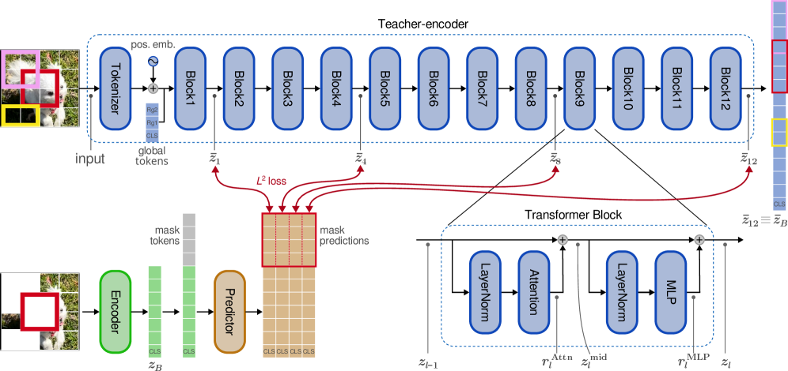

# 论文解读：Self-Distillation of Hidden Layers for Self-Supervised Representation Learning

**作者**：Scott C. Lowe, Anthony Fuller, Sageev Oore, Evan Shelhamer, Graham W. Taylor  
**机构**：Vector Institute, Carleton University, Dalhousie University, University of British Columbia, University of Guelph  
**arXiv**：2603.15553 | **日期**：2026年3月16日

---

## TLDR

本文提出 Bootleg 方法，通过预测教师网络中**多个隐藏层**的潜在表示来进行自监督学习，桥接了生成式方法（MAE）和预测式方法（I-JEPA）之间的鸿沟。在 ImageNet-1K 分类任务上，Bootleg 比 I-JEPA 高出 10% 以上的准确率，在语义分割任务上也取得了显著提升。

---

## 动机与发现

### 问题：
当前自监督学习方法存在两难选择：
- **生成式方法**（如 MAE）：重建原始像素，计算效率低，且不优先学习高层语义特征
- **预测式方法**（如 I-JEPA）：预测最终层嵌入，但依赖非平稳目标导致训练不稳定

### 关键发现

1. **隐藏层目标优于最终层**：预测教师网络中间层的表示比仅预测最终层效果更好
2. **多层目标组合更优**：同时预测多个隐藏层的组合优于单个隐藏层
3. **掩码策略决定稳定性**：随机掩码会导致训练崩溃，而结构化掩码（如 I-JEPA 的矩形掩码）能稳定训练
4. **空间连续性很重要**：较大的连续掩码区域比小块随机掩码效果更好

*图1: Bootleg 多层自蒸馏方法。教师编码器（蓝色）、学生编码器（绿色）和预测器（橙色）都是 ViT。教师编码器是学生编码器的 EMA，处理完整图像。学生编码器只看到图像的子集，预测器需要预测教师编码器中多个层的表示。*

---

## 方法

**核心思想**

Bootleg 通过预测教师网络中多个隐藏层的表示来学习多层次的抽象特征。与 I-JEPA 仅预测最终层不同，Bootleg 同时预测早期、中期和深层的表示，迫使模型捕获不同抽象级别的特征。

### 掩码策略

基于 I-JEPA 的改进实现：
- 将图像分割成 P×P 的补丁
- 随机选择 4 个矩形区域进行掩码
- 掩码区域可以重叠
- 未掩码的补丁作为学生编码器的输入

**关键创新点：**
- 使用结构化矩形掩码而非随机掩码，提高训练稳定性
- 掩码区域之间通过自注意力交互，但不同掩码区域之间无交互

### 目标层选择

从教师编码器的多个层提取目标：
- **目标层分布**：均匀分布在编码器深度上，每 4 个块取一个（如第 1、4、8、12 块）
- **标准化**：对每个目标位置的嵌入进行 z-score 标准化
- **拼接**：将所有目标层的表示拼接成单一目标向量（长度为 |L|×D）

**实现细节：**
- 使用 EMA 教师-学生架构，教师权重是学生权重的指数移动平均
- 教师编码器处理完整图像
- 学生编码器处理未掩码的补丁，外加 5 个全局令牌（1 个 CLS + 4 个 register）

### 预测器架构

- 使用与 MAE 相同的 ViT 预测器架构
- 最终线性层更宽，以投影到增加的目标元素数量
- 4 个预测器 register 令牌用于全局处理
- 四个掩码区域并行处理，各自内部有自注意力交互

---

## 实验设定与结果

### 实验配置

- **预训练数据**：ImageNet-1K（IN-1k）
- **模型架构**：ViT-S/16、ViT-B/16、ViT-L/16
- **图像尺寸**：224×224，补丁大小 16×16
- **训练轮数**：600 epochs（基线方法使用 600-1600 epochs）
- **评估方法**：冻结编码器 + 探针（线性探针、注意力探针）

### 核心结果

#### ImageNet-1K 分类（冻结探针）

| 方法 | ViT-S (X-Blk) | ViT-B (X-Blk) | ViT-L (X-Blk) |
|------|---------------|---------------|---------------|
| MAE | 66.4% | 76.0% | 79.5% |
| I-JEPA | 61.9% | 72.4% | 72.3% |
| data2vec 2.0 | 62.2% | 73.7% | 80.0% |
| **Bootleg** | **75.3%** | **79.2%** | **80.6%** |

#### iNaturalist-21 分类（冻结探针）

| 方法 | ViT-S (X-Blk) | ViT-B (X-Blk) | ViT-L (X-Blk) |
|------|---------------|---------------|---------------|
| I-JEPA | 48.4% | 63.0% | 61.3% |
| **Bootleg** | **67.4%** | **74.2%** | **77.1%** |

#### ADE20K 语义分割（冻结编码器）

| 方法 | ViT-S (Lin) | ViT-B (Lin) | ViT-L (Lin) |
|------|-------------|-------------|-------------|
| I-JEPA | 11.8% | 19.3% | 21.8% |
| **Bootleg** | **26.6%** | **30.9%** | **34.7%** |

#### Cityscapes 语义分割（冻结编码器）

| 方法 | ViT-S (Lin) | ViT-B (Lin) | ViT-L (Lin) |
|------|-------------|-------------|-------------|
| I-JEPA | 19.8% | 24.3% | 25.5% |
| **Bootleg** | **32.1%** | **35.9%** | **39.1%** |

---

## 启示和结论

### 主要贡献

1. **提出隐藏层自蒸馏方法**：首次系统性地探索预测多个隐藏层表示的自监督学习，发现中间层目标比最终层更有效
2. **改进训练稳定性**：通过结构化掩码和多层次目标解决了自蒸馏方法的训练不稳定问题
3. **统一生成式与预测式方法**：Bootleg 桥接了 MAE（像素级）和 I-JEPA（嵌入级）之间的差距
4. **显著的性能提升**：在所有评估任务上大幅超越现有方法，特别是在小模型上提升超过 10%

### 理论意义

- 验证了"最深层不一定最好"的假设：中间层的特征对许多下游任务更有用
- 信息瓶颈视角：通过增加目标层数量提高压缩比，迫使模型更好地理解输入
- 与大脑预测编码模型的类比：多层次预测类似于大脑中不同层级的视觉处理

### 实践价值

- **计算效率**：单视角方法，不需要大批量训练，在单个消费级 GPU 上即可预训练
- **通用性强**：不需要特定的数据增强策略，易于迁移到其他领域（视频、音频、医学图像等）
- **即插即用**：隐藏层自蒸馏可以与其他掩码方法（MAE、CrossMAE、data2vec）结合使用

### 局限性

- 在合成图像（如 Clevr、dSprites）上的表现不如自然图像
- 预测器需要更宽的最终层来处理多个目标，增加了少量计算开销
- 最佳目标层选择仍需要一定的经验（论文建议每 4 个块取一个）

---

**代码**：论文中提到代码将通过 GitHub 发布，但目前尚未公开
