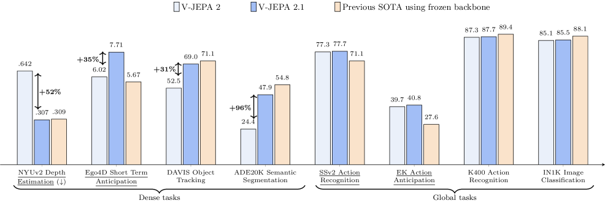
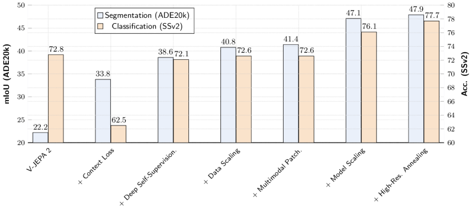

# 论文解读：V-JEPA 2.1: Unlocking Dense Features in Video Self-Supervised Learning

**作者**：Lorenzo Mur-Labadia, Matthew Muckley, Amir Bar, Mido Assran, Koustuv Sinha, Mike Rabbat, Yann LeCun, Nicolas Ballas, Adrien Bardes
**机构**：FAIR at Meta, Universidad de Zaragoza
**arXiv**：2603.14482 | **日期**：2026年3月17日

---

## TLDR

V-JEPA 2.1 是一种自监督视频表征学习方法，通过四个关键改进解决了视频自监督学习中密集特征质量差的问题。核心创新在于将预测损失扩展到所有token（包括可见和被遮蔽的patch），而非仅监督被遮蔽区域。该方法在多个基准测试中取得了SOTA结果：Ego4D短期物体交互预测达7.71 mAP，EPIC-KITCHENS动作预测达40.8 Recall@5，机器人抓取成功率比V-JEPA 2 AC提升20%。

*图1: V-JEPA 2.1 ViT-G在密集和全局预测任务上的性能。显示了V-JEPA 2.1相对于前代V-JEPA 2 ViT-g模型的相对改进。*

---

## 动机与发现

### 问题：视频自监督学习中的密集特征质量问题

V-JEPA系列模型在全局视频理解、动作预测和规划方面表现出色，但其学习到的表征在密集视觉任务（如语义分割、深度估计）上表现有限。PCA可视化显示特征图存在噪声且局部空间结构破碎，ADE20K语义分割仅22.2 mIoU，NYUv2深度估计RMSE为0.682。

### 关键发现

1. **监督缺失假说**：V-JEPA 2仅对被遮蔽token应用预测损失，未遮蔽的上下文token缺乏监督，导致模型将计算资源用于聚合全局信息而非编码局部结构。
2. **上下文监督有效性**：对上下文token引入监督损失ℒctx后，特征图显示出清晰的局部结构，ADE20K性能从22.2提升至33.9 mIoU。
3. **权衡问题**：简单的上下文监督会损害全局理解能力（SSv2从72.8降至62.5），需要精细的权重设计。

---

## 方法

**核心思想**

V-JEPA 2.1通过四个关键组件学习同时具备高质量密集局部特征和全局语义理解的表征：密集预测损失、深度自监督、多模态tokenizer以及数据和模型扩展。

*图2: V-JEPA 2.1详细架构。图像和视频分别通过2D或3D卷积patch嵌入处理，添加3D旋转位置编码和可学习模态嵌入。x编码器处理可见token并输出多层嵌入，MLP融合多层表示并降维。这些上下文token与携带时空位置信息的可学习掩码token拼接，预测器处理组合序列并为掩码token生成多层预测。*

### 密集预测损失

提出ℒdense = ℒpredict + ℒctx，对所有token（被遮蔽和可见patch）应用自监督损失。ℒctx采用距离加权方案：λi = λ / √(d_min(i,M))，其中d_min是上下文token到最近掩码token的距离。这种加权强调靠近掩码区域的patch，通过强制局部连续性来平衡分割和动作识别性能。

### 深度自监督

在编码器中间层应用自监督目标：将三个中间层输出与最终输出拼接，通过轻量级MLP融合降维。预测器生成四个输出对应四个编码器层，两个损失在每层都应用。深度自监督恢复了全局理解能力（SSv2 72.0，IN1K 80.8），同时提升了密集任务性能（ADE20K 38.6 mIoU）。

**关键创新点：**
- 将预测损失扩展到所有token，防止可见token充当全局聚合器
- 距离加权的上下文监督，平衡局部结构学习和全局理解

### 数据和模型扩展

构建VisionMix-163M数据集：将V-JEPA 2的1M图像替换为LVD-142M，调整视频采样策略（SSv2权重从0.056增至0.170，YT-1B从0.188增至0.720）。模型从ViT-g（300M）扩展到ViT-G（2B），配合高分辨率冷却阶段（视频64帧384×384，图像512×512）。

*图3: V-JEPA 2.1训练配方各组件的影响。消融实验从ViT-L架构开始，在ADE20k单图像语义分割和SSv2动作分类上进行。引入加权上下文自监督显著提升分割但损害分类，深度自监督恢复并进一步提升分割性能。*

---

## 实验设定与结果

### 实验配置

- **数据集**：VisionMix-163M（142M图像 + 21M视频）
- **评估协议**：密集任务使用线性探测，全局任务使用注意力探测
- **密集任务**：ADE20K语义分割、NYUv2深度估计、YouTube-VOS视频目标分割
- **全局任务**：SSv2动作识别、ImageNet图像分类、Ego4D/EPIC-KITCHENS预测任务

### 核心结果

V-JEPA 2.1 ViT-G在冻结骨干网络评估中达到SOTA：

| 任务 | 数据集 | 指标 | V-JEPA 2.1 | 前代SOTA |
|------|--------|------|------------|----------|
| 深度估计 | NYUv2 | RMSE ↓ | **0.307** | DINOv3 |
| 语义分割 | ADE20K | mIoU | **47.9** | DINOv3 |
| 动作识别 | SSv2 | Acc. | **77.7%** | DINOv3 |
| 物体交互预测 | Ego4D | mAP | **7.71** | STAformer |
| 动作预测 | EPIC-KITCHENS | Recall@5 | **40.8** | PlausiVL |
| 机器人抓取 | Franka臂 | 成功率 | **+20%** | V-JEPA 2 AC |
| 机器人导航 | Tartan Drive | ATE ↓ | **5.687** | 前代工作 |

---

## 启示和结论

### 主要贡献

1. **密集预测损失**：发现仅监督被遮蔽token导致密集特征质量差，提出对所有token应用自监督损失
2. **深度自监督**：在编码器中间层应用自监督目标，平衡密集和全局任务性能
3. **数据和模型扩展**：构建VisionMix-163M数据集，扩展到ViT-G（2B参数）并引入高分辨率冷却

### 理论意义

- 揭示了视频自监督学习中密集特征质量与监督范围的关系
- 证明了深度自监督在平衡局部和全局表征中的有效性

### 实践价值

- 为机器人感知和规划提供了更强的视觉表征
- 提供了从2B模型蒸馏到80M/300M小型模型的实用方案
- 代码和预训练模型已开源，促进后续研究和应用

### 局限性

- 计算资源需求大：ViT-G训练需要大量GPU资源
- 视频长度限制：当前处理16-64帧，长视频处理需要进一步研究
- 多模态扩展：当前主要关注视觉，与语言等模态的融合未深入探索

---

**代码**：https://github.com/facebookresearch/vjepa2